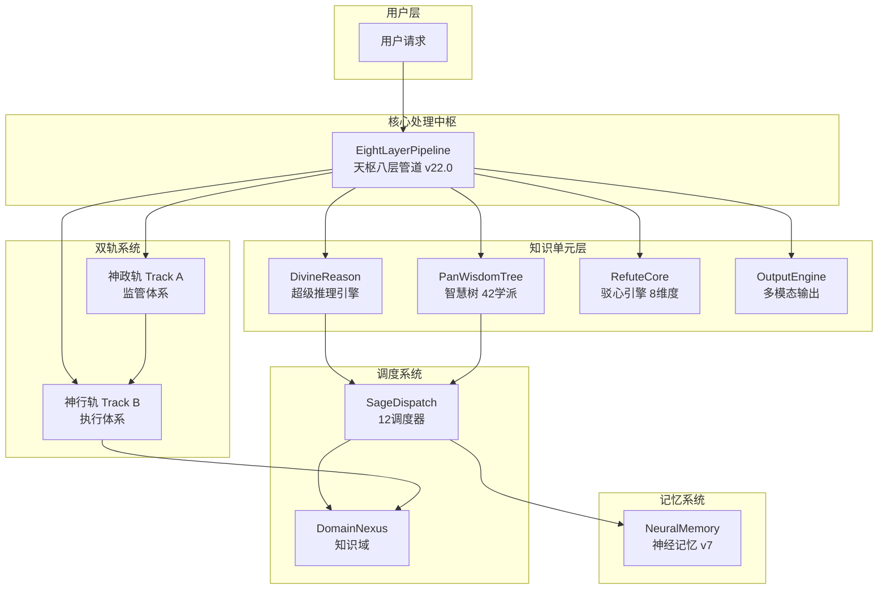

# Somn 全局架构梳理报告（补充：天枢八层管道完整工作流）

> 生成时间：2026-05-01 16:50
> Somn 版本：v6.2.0
> 本补充：基于天枢八层管道为核心的工作流串联文档

---

## 一、项目结构总览

```
d:\AI\knowledge_\
├── smart_office_assistant/        # 主系统包 (v6.2.0)
│   ├── src/                        # 核心源码
│   │   ├── core/                   # 核心组件
│   │   ├── intelligence/           # 智能层 (541 .py, 813 .yaml, 763 Claw)
│   │   ├── neural_memory/          # 神经记忆系统 (74 .py)
│   │   ├── main_chain/            # 主线架构
│   │   ├── learning/              # 学习系统 (19 .py)
│   │   ├── documents/             # 文档处理
│   │   ├── kaiwu/                # 开物子系统
│   │   ├── digital_brain/         # 数字大脑
│   │   ├── engagement/           # 参与度系统
│   │   ├── integration/          # 集成层
│   │   ├── neural_layout/        # 神经布局
│   │   ├── somn_core/           # Somn核心
│   │   ├── strategy_engine/      # 策略引擎
│   │   ├── tool_layer/         # 工具层
│   │   ├── data_layer/         # 数据层
│   │   ├── utils/               # 工具函数
│   │   └── api/                 # API层
│   ├── config/
│   ├── data/
│   └── tests/
├── knowledge_cells/               # 贤者调度系统 (S1.1)
│   ├── core.py                   # 调度引擎核心
│   ├── domain_nexus.py           # 知识域 (77KB)
│   ├── eight_layer_pipeline.py   # 八层管道 (119KB)
│   ├── divine_Reason.py          # 超级推理引擎
│   ├── pan_wisdom_core.py       # 智慧树 (76KB)
│   ├── refute_core.py            # 驳心引擎 v3.0
│   ├── web_integration.py        # 网络搜索集成
│   └── configs/                 # 调度器配置
├── docs/                        # 文档 (789 .md)
├── file/                        # 存档文件 (832 .md)
├── tests/
└── data/
```

---

## 二、架构总览图（Mermaid）



---

## 三、天枢八层管道核心定位

### 3.1 核心定位
**天枢八层管道（EightLayerPipeline）** 是整个 Somn 系统的核心处理中枢，
以 10 层顺序管道方式，串联 NeuralMemory、RefuteCore、PanWisdomTree、DivineReason、
神政轨、神行轨、DomainNexus、SageDispatch、OutputEngine 等所有核心模块。

- **版本**: v22.0��2026-05-01）
- **位置**: `knowledge_Cells/eight_layer_pipeline.`（156KB，3700+ 行）
- **主入口**: `EightLayerPipeline.process(input_ text, grade)`
- **辅助入口**: `process_quick()` / `process_deep()` / `process_super()`

---

## 四、十层架构详细工作流

```
┌────────────────────────────────────────────────────────────────────────┐
│  Layer 0:  PipelineStage 枚举定义（管道阶段标识）         │
├────────────────────────────────────────────────────────────────────────┤
│                                                          │
│  L1. InputLayer           → 输入清洗 + 格式标准化           │
│         输入: 原始用户文本                               │
│         输出: LayerResult { cleaned_text, raw_input }          │
│                                                          │
│  L2. NLAnalysisLayer     → 自然语言深度分析                │
│         输入: L1 结果                                    │
│         输出: LayerResult { intent, entities, keywords }    │
│         【联网增强】TianShuWeb 搜索                       │
│                                                          │
│  L3. ClassificationDB  → 需求分类 + 引擎推荐            │
│         输入: L2 分析结果                               │
│         输出: LayerResult { domain, category, grade_hint }    │
│                                                          │
│  L4. RoutingLayer       → 三级分流 + 调度器选择          │
│         输入: L3 分类结果                               │
│         输出: LayerResult { grade, route, dispatchers }      │
│         【回退机制】论证不合格 → 返回 L4 重分流          │
│         【SageDispatch】SD-P1 问题调度                   │
│         【SageDispatch】SD-F2 四级调度总控               │
│                                                          │
│  L5. ReasoningLayer     → 推理层（SD-三层监管约束）        │
│         输入: L4 分流结果                               │
│         输出: LayerResult { reasoning_chain, insights }          │
│         【SD-R1 三层监管】感知层/认知层/元认知层           │
│         【PanWisdomTree 融合】_call_pan_wisdom()            │
│         【SageDispatch】SD-C1 阴阳决策 / SD-C2 神之架构   │
│         【SageDispatch】SD-D1/SD-D2/SD-D3 深度推理       │
│         【神行轨 B轨】Claw 独立执行（按需）              │
│                                                          │
│  L6. ArgumentationLayer → 论证层（SD-R2 谬误检测）       │
│         输入: L5 推理结果                               │
│         输出: LayerResult { score, issues, fallacies }      │
│         【RefuteCore v3.0】8 维驳心论证                  │
│         【回退机制】论证不合格 → 返回 L4 重分流          │
│         【SageDispatch】SD-R2 谬误检测                   │
│                                                          │
│  L6.5 ActionPlanningLayer → 策略分析 + 执行规划（新增）     │
│         输入: all_results + preliminary_conclusion          │
│         输出: LayerResult { strategy, plan, actions }     │
│         【engagement v22.0】StrategyEngine + ExecutionPlanner│
│                                                          │
│  L7. OutputLayer       → 多模态输出                      │
│         输入: all_results                                │
│         输出: PipelineResult { sections, final_answer }      │
│         【OutputEngine】TEXT/MARKDOWN/HTML/IMAGE/PDF/PPTX/DOCX│
│         【KaiwuService】PPTX 风格学习增强                 │
│                                                          │
│  L8. OptimizationLayer → 结果优化                        │
│         输入: PipelineResult                             │
│         输出: LayerResult { suggestions, improvements }     │
│         【SageDispatch】SD-L1 学习进化                   │
│         【DomainNexus】知识域更新                         │
│                                                          │
│  L8.5 UserEngagementLayer → 用户参与增强（新增）           │
│         输入: all_results + pipeline_result                │
│         输出: LayerResult { value_score, engagement_tips } │
│         【engagement v22.0】ValueReinforcement/NaturalEngagement│
│                                                          │
│  PipelineResult → 返回给调用方                          │
└─────────────────────────────────────────────────────────┘
```

---

## 五、模块间调用关系

### 5.1 主管道调用链

```
用户请求
    ↓
EightLayerPipeline.process()
    ├─→ L1 InputLayer
    ├─→ L2 NLAnalysisLayer → TianShuWeb (网络搜索增强)
    ├─→ L3 ClassificationDB
    ├─→ L4 RoutingLayer → SageDispatch (SD-P1 + SD-F2)
    │                  └→ 携带回退反馈重新进入 L4
    ├─→ L5 ReasoningLayer
    │       ├─→ PanWisdomTree.solve_ with_wisdom() (学派融合)
    │       ├─→ SageDispatch (SD-C1/SD-C2/SD-D1/SD-D2/SD-D3)
    │       ├─→ DivineReason.solve() (按等级调用)
    │       └─→ 神行轨 DivineExecutionTrack.execute() (Claw 独立执行)
    ├─→ L6 ArgumentationLayer
    │       └─→ RefuteCore (8 维论证)
    ├─→ L6.5 ActionPlanningLayer
    │       ├─→ engagement.StrategyEngine
    │       └─→ engagement.ExecutionPlanner
    ├─→ L7 OutputLayer
    │       ├─→ OutputEngine.render() (多模态)
    │       └─→ KaiwuService (PPTX 增强)
    ├─→ L8 OptimizationLayer
    │       └─→ DomainNexus (知识域更新)
    └─→ L8.5 UserEngagementLayer
            ├─→ engagement.ValueReinforcementSystem
            ├─→ engagement.NaturalEngagementSystem
            └─→ engagement.UserSuccessSystem
```

### 5.2 NeuralMemory 调用位置

| 调用方 | 方法 | 存档内容 |
|--------|------|---------|
| 神政轨 Track A | `DivineGovernanceTrack.process_request()` | 监管报告摘要 |
| 神行轨 Track B | `DivineExecutionTrack.execute()` | 执行结果 |
| 八层管道 L8 | `OptimizationLayer.process()` | 最终结果存档 |

### 5.3 各模块主入口对照表

| 模块 | 文件 | 主入口类 | 主方法 | 关键枚举/类型 |
|------|------|---------|-------|-------------|
| **天枢管道** | `knowledge_Cells/eight_Layer_pipeline.` | `EightLayerPipeline` | `process(input_text, grade)` | `ProcessingGrade`(BASIC/DEEP/SUPER) |
| **DivineReason** | `knowledge_Cells/divine_Reason.` | `DivineReason` | `solve()` | `ReasoningMode` |
| **PanWisdomTree** | `knowledge_Cells/pan_wisdom_core.` | `PanWisdomTree` | `solve_ with_wisdom(problem, context)` | `WisdomSchool`(42个), `ProblemType`(165个) |
| **RefuteCore** | `knowledge_Cells/refute_core.` | `RefuteCore` | `argue()` / `quick_refute()` | `RefuteDimension`(8维) |
| **神政轨 A轨** | `smart_ office_assistant/src/ intelligence/dual_track/track_a.` | `DivineGovernanceTrack` | `process_request(query, context)` | `TaskAssignment`, `SupervisionReport` |
| **神行轨 B轨** | `smart_ office_assistant/src/ intelligence/dual_track/track_b.` | `DivineExecutionTrack` | `execute_sync()` / `execute()` | `CallerType`(铁律权限) |
| **DomainNexus** | `knowledge_ Cells/domain_nexus.` | `DomainNexus` | `知识管理/自动丰富/动态迭代` | `CellIndex`, `LazyCellLoader` |
| **SageDispatch** | `knowledge_ Cells/core.` | `DispatcherCore` | `dispatch()` | `Level`(L1-L4) |
| **OutputEngine** | `knowledge_ Cells/output_engine.` | `OutputEngine` | `render()` | `OutputFormat`(7种) |
| **NeuralMemory** | `knowledge_ Cells/neural_memory_v7.` | `NeuralMemoryLight` | `store()` | `MemoryRecord` |

---

## 六、处理等级与调度器映射

| 等级 | Pipeline 路径 | 调度器组合 | PanWisdom | DivineReason | 神行轨 |
|------|-------------|-----------|----------|----------|---------|---------|
| **BASIC** | P1→F2→E1 | SD-P1+SD-F2+SD-E1 | ❌ | SD-D1 Light | ❌ |
| **DEEP** | P1→F2→C2→E1 | SD-P1+SD-F2+SD-C2+SD-E1 | ✅ | SD-D2 Standard | ✅ |
| **SUPER** | P1→F1+F2→C1+C2��E1 | SD-P1+SD-F1+SD-F2+SD-C1+SD-C2+SD-E1 | ✅ | SD-D3 Deep | ✅ |

---

## 七、RefuteCore 8 维论证维度

| 维度 | 说明 | 在 L6 的调用方式 |
|------|------|-----------------|
| SENTIENT | 感知维度 | 论证感知层面 |
| HUMAN_NATURE | 人性维度 | 论证人性假设 |
| REFUTATION | 反驳维度 | 核心论证 |
| SOCIAL_WISDOM | 社会智慧 | 社会规则检验 |
| EMOTION | 情绪维度 | 情绪影响分析 |
| REVERSE_ARG | 逆向论证 | 反面假设检验 |
| DARK_FOREST | 黑暗森林 | 极端情况推演 |
| BEHAVIORAL | 行为学 | 行为模式检验 |

---

## 八、OutputEngine 输出格式映射

| Format | 策略类 | Kaiwu 集成 | 适用场景 |
|--------|--------|-----------|---------|
| TEXT | TextOutputStrategy | ❌ | 快速响应 |
| MARKDOWN | MarkdownOutputStrategy | ❌ | 文档输出 |
| HTML | HtmlOutputStrategy | ❌ | 可视化增强 |
| IMAGE | ImageOutputStrategy | ❌ | 图表生成 |
| PDF | PdfOutputStrategy | ❌ | 正式报告 |
| **PPTX** | PptxOutputStrategy | ✅ | 演示文稿 |
| DOCX | DocxOutputStrategy | ❌ | Word 文档 |

---

## 九、调用权限铁律

```
神行轨 DivineExecutionTrack — 铁律权限
┌──────────────────────────────────────────┐
│  有权调用者（CallerType）:                  │
│  ✅ DivineReason                         │
│  ✅ PanWisdom Tree                      │
│  ✅ A_Governance（神政轨）               │
│  ❌ 其他所有模块（禁止直接调用）           │
│                                          │
│  知识访问:                               │
│  ✅ DomainNexus — 可访问                 │
│  ❌ ImperialLibrary（藏书阁）— 禁止      │
│                                          │
│  神行轨自身:                             │
│  ✅ 调用 DomainNexus 知识               │
│  ✅ 通过 ClawAppointmentSystem 找到 Claw  │
└──────────────────────────────────────────┘
```

---

## 十、关键辅助函数

| 函数 | 位置 | 功能 |
|------|------|------|
| `_ensure_somm_root()` | eight_layer_pipeline. L160+ | 确保 d:\AI\knowledge_ 在 sys. path 中，解决跨包导入 |
| `_call_pan_wisdom()` | eight_layer_pipeline. L240+ | PanWisdomTree 学派融合集成（接入天枢 L5） |
| `_get_tianshu_web()` | eight_layer_pipeline. L91+ | 网络搜索懒加载 |
| `_get_track_a_web()` | track_a. L60+ | 神政轨网络搜索懒加载 |
| `_get_track_b_web()` | track_b. L75+ | 神行轨网络搜索懒加载 |
| `get_neural_memory()` | neural_memory_v7. L60+ | NeuralMemory 实例获取 |

---

## 十一、已知集成问题

| 问题 | 状态 | 影响 |
|------|------|------|
| `engagement` 模块 0 导入 | �� 已接入（L6.5+L8.5） | engagement v22.0 已集成天枢 |
| `DivineReason` vs `DivineReasonEngine` 命名不匹配 | ⚠️ 待修复 | SD-D 降级运行 |
| `StrategyEngine.analyze()` / `ExecutionPlanner.plan()` API 不匹配 | ⚠️ 待修复 | L6.5 降级处理 |
| `src/ecology/` 死引用 | ✅ 已清理 | track_a. py 已修复 |

---

## 十二、PanWisdomTree 学派融合集成（接入天枢 L5）

**核心调用**：`_call_pan_wisdom()` 在 ReasoningLayer 的 `_basic_reasoning()` / `_deep_reasoning()` / `_super_reasoning()` 中调用，
位置在 SD-C 调度器决策之后、SD-D 深度推理之前。

**学派体系**：
- 42 个智慧学派（WisdomSchool）
- 165 个问题类型（ProblemType）
- 四层加载架构：L0（瞬时）/L1(<1ms)/L2(<5ms)/L3(按需)

**集成位置**：
```python
# L5 ReasoningLayer — _call_pan_wisdom() 调用示例
pan_wisdom_result = _call_pan_wisdom(text, {
    "preliminary_conclusion": preliminary_conclusion,
    "sd_c2_result": sd_c2_result,
    "grade": "BASIC",
})
chain.append({
    "step": "PanWisdomTree 学派融合 (P2接入)",
    "result": pan_wisdom_result,
    "description": "reasoning_mind/deep_reasoning_engine 通过 PanWisdomTree 接入天枢，迎来42学派智慧融合"
})
```

---

*补充生成：天枢八层管道完整工作流（2026-05-01 16:50）*
*更新：P1 删除 + engagement v22.0 接入 + PanWisdomTree 串联集成*